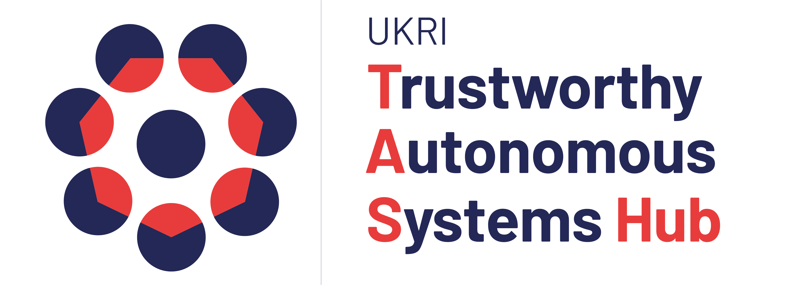
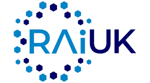

> **Update:** We have a submission deadline extension: **Thursday, 2nd May, 2024**

# **About**
This second ACM C&C workshop on explainable AI for the Arts (XAIxArts) brings together a community of researchers and creative practitioners in Human-Computer Interaction (HCI), Interaction Design, AI, explainable AI (XAI), and Digital Arts to explore the role of XAI for the Arts. XAI is a core concern of Human-Centred AI and relies heavily on HCI techniques to explore how to make complex and difficult to understand AI models more understandable to people. Our [first workshop](./2023) explored the landscape of XAIxArts and identified emergent themes. To move the discourse on XAIxArts forward and to contribute to Human-Centred AI more broadly this workshop will: 
* Bring researchers together to expand the XAIxArts community; 
* Collect and critically reflect on current and emerging XAIxArts practice; 
* Co-develop a manifesto for XAIxArts; 
* Co-develop a proposal for an edited book on XAIxArts; 
* Engage with the wider discourse on Human-Centred AI.

### Important Information   
* **Venue:** Hybrid (Chicago, IL, USA and Online)    
* **Submission Deadline:** <del>Thursday, 2nd May, 2024</del>  
* **Notifications:** Thursday 16th May, 2024
* **Camera-Ready Submission:** Thursday 6th June, 2024   
* **Workshop Date:** Sunday, 23rd June, 2024  

## **Themes**

This workshop will explore how XAI might be used in the Arts and how the Arts might contribute to new forms of XAI. It will examine the challenges and opportunities at the intersection of XAI and the Arts (XAIxArts), offering a fresh and critical view on the explainable aspects of Responsible AI and Human-Centred AI more broadly. The themes include **but are not limited to**:  

### Temporal Aspects of Explanations
Moment-by-moment feedback is essential for the creative process in Arts domains from music to sketching. For example, exploring real-time AI audio generation that requires immediate feedback and audio generation whilst navigating an AI model. Importantly for XAIxArts in-the-moment explanations differ in style from the post-hoc explanations typical of broader XAI research. The role of time itself may also be different in XAI for the Arts compared to broader XAI approaches. For example, creative practice unfolds over seconds, days, or even years. This contrasts single-shot use of XAI more broadly where an explanation might be used to understand an AI’s decision and is then discarded. Additionally, AI explanations should consider the phase of the creative process, as it influences user preferences for AI contributions.

### Tailored Explanations  
Explanations need to be tailored to individual users based on their skills, experience, and context, as there can be no single appropriate explanation. For example, tailoring explanations to an individual's AI literacy and abilities. Moreover, in the Arts we may need to tailor explanations to audiences and even bystanders.

### AI as Material  
The AI model itself may be an artwork. In XAIxArts, traversing an AI model may be both an artwork and a form of explanation. For example, artists navigating a generative AI model to expose its bias or navigating a model's latent space to explain its limits. Or creating AI artworks that are experienced by and even navigated by audiences as a form of explanation. Indeed, current XAI could be augmented using creative methods from the Arts, interaction design and HCI to address XAI's current focus on technical and functional explanations. These are artist-led rather than model-led or technologist-driven explanations of AI models in the Arts. However, they raise questions of who or what might be responsible for an explanation if it relies on sense-makings of the art itself - is it the AI model, the artist, or the audience? And, how do we use Arts practices to inform the design of more intuitive, holistic, useful or engaging ways in which the decisions and actions of AI can be made more understandable to people?

### XAI in Generative Tools  
Current AI generative tools provide surprisingly little explanation of how they work, how artistic requirements might be specified or explored, nor how their use impacts the environment through energy consumption. Furthermore, in the artistic use of AI Generated Content (AIGC), we might want to actively search out and recreate errors or glitches in AI models as part of creative practice rather than removing them as might be conventionally undertaken with XAI. Here, XAI approaches such as contrastive examples or conversational interfaces might offer greater opportunities for trial-and-error creative practice with AI. Thinking further down the AI-artist journey, XAI may offer opportunities for artistic practice with AIGC to be recorded, revisited, and reinterpreted as a form of reflective practice with AI. This explanation of practice might also offer windows into the creative mind of the artist for the audience and consumers of their AIGC works.  

### Ethics and Responsibility   
Responsible AI is a key research field that XAI contributes to, especially in terms of explaining and understanding the ethics of AIGC. A concern for XAIxArts is how we might both support and disrupt trust in AI in the Arts. XAI could take a proactive role in explaining the provenance and attribution of AIGC and its biases. However, care needs to be taken in XAIxArts as the explanation of an AI Artwork may essentially devalue the constructed meaning of the piece.  

# **Call for Participation**  

To participate in the workshop, please submit either A) a position paper, B) a short video, or C) a pictorial. Your submission should tell us about your XAI and/or Arts research and practice addressing the themes and open questions on the workshop website. Submission requirements are:  

* **A) Position paper**\
Papers should be submitted to the [EasyChair](https://easychair.org/conferences/?conf=xaixarts2024) as a PDF in the [ACM SIGCHI submission template format](https://www.acm.org/publications/proceedings-template) (SIGCHI ACM new, standardized single-column format, in LaTex use the command `\documentclass[manuscript,review]`) and a maximum of 4 pages in length. Note that Microsoft Word users should use the interim template.
  * Please include the workshop details in your submission (use the following LaTeX command in the preamble of your document: `\acmConference[XAIxArts 2024]{Explainable AI for the Arts Workshop 2024}{June 23, 2024}{Chicago, IL, United States}`).  
  * Papers do not need to be anonymised.  
  * Papers do not need to include the CCS codes.  
  * Papers do not need to include the submission date information.  

* **B) Short video**\
Upload your video (maximum 5 minutes, maximum file size 50MB) to a file transfer site such as WeTransfer and submit a PDF document to the [EasyChair](https://easychair.org/conferences/?conf=xaixarts2024) stating that this is a video submission and providing the URL to download your video. Note that videos cannot be uploaded directly to the EasyChair system. Please ensure that the download link is valid until at least to June 24, 2024. Please complete all sections of the EasyChair submission system including providing a Title and Abstract to briefly describe the content of your video.

* **C) Pictorial**\
Pictorials should be submitted to [EasyChair](https://easychair.org/conferences/?conf=xaixarts2024) using the C&C 2024 Pictorials template (for [inDesign](https://www.dropbox.com/scl/fi/i3so7lro1e30pszznjns5/ACM_CC_Pictorials_inDesign_template_2024-Folder.zip?rlkey=rgt3e540325jt35i4h4ecguan&dl=0), [Word](https://www.dropbox.com/scl/fi/9xy15okrmuypmfpzy9pkq/ACMCC_2024_Pictorials_WORD_Template.docx?rlkey=os22ov5s5eutfs5yg4yv7j1by&dl=0) or [Powerpoint](https://www.dropbox.com/scl/fi/d9q65llbd68uyeh746byk/ACMCC_2024_Pictorials_PowerPoint_Template.pptx?rlkey=jsbt92t7x1t3v46twasvbq8mj&dl=0)), maximum 4 pages PDF. Maximum file size 50MB. Include the submission's title, author(s) and their affiliation(s), and a 150-word abstract on the first page. In keeping with C&C Pictorial submissions, additional written sections such as Introduction, Conclusion, Discussion, Acknowledgements, and References are *optional*. The submission should focus on an annotated visual composition and use the format creatively. Examples can be found on the [C&C 2024 website](https://cc.acm.org/2024/pictorials/). Please complete all sections of the EasyChair submission system, including a Title and Abstract.  

Participants will be selected based on the quality of their contribution to the debate about XAIxArts with a view to creating a balance of topics in the workshop. Accepted papers, pictorials, and videos will be shared with participants via the workshop website prior to the workshop, and the copyright is retained by the authors.  

At least one author of each accepted position paper must attend the workshop and that all participants must register for both the workshop and the ACM Creativity and Cognition 2024 conference.  

# **Organizers**

* Nick Bryan-Kinns (Chair), University of the Arts London, United Kingdom  
* Corey Ford, Queen Mary University of London, United Kingdom  
* Shuoyang Zheng, Queen Mary University of London, United Kingdom  
* Helen Kennedy, University of Nottingham, United Kingdom  
* Alan Chamberlain, University of Nottingham, United Kingdom  
* Makayla Lewis, Kingston University, United Kingdom  
* Drew Hemment, University of Edinburgh, United Kingdom  
* Zijin Li, Central Conservatory of Music, China  
* Qiong Wu, Tsinghua University, China  
* Lanxi Xiao, Tsinghua University, China   
* Gus Xia, MBZUAI, United Arab Emirates   
* Jeba Rezwana, Towson University, United States  
* Michael Clemens, University of Utah, United States  
* Gabriel Vigliensoni, Concordia University, Canada  

# **Acknowledgements**
We would like to acknowledge the support of the Engineering and Physical Sciences Research Council - [grant number EP/T022493/1] Horizon: Trusted Data-Driven Products, [grant number EP/Y009800/1] AI UK: Creating an International Ecosystem for Responsible AI Research and Innovation & [grant number EP/V00784X/1] UKRI Trustworthy Autonomous Systems Hub.

{:width="32%"} {:width="40%"}{:width="26%"} 

# **Contacts**
If you have any questions feel free to contact Nick, Corey or Shuoyang at the following email addresses:
- n.bryankinns@arts.ac.uk  
- c.j.ford@qmul.ac.uk  
- shuoyang.zheng@qmul.ac.uk  

